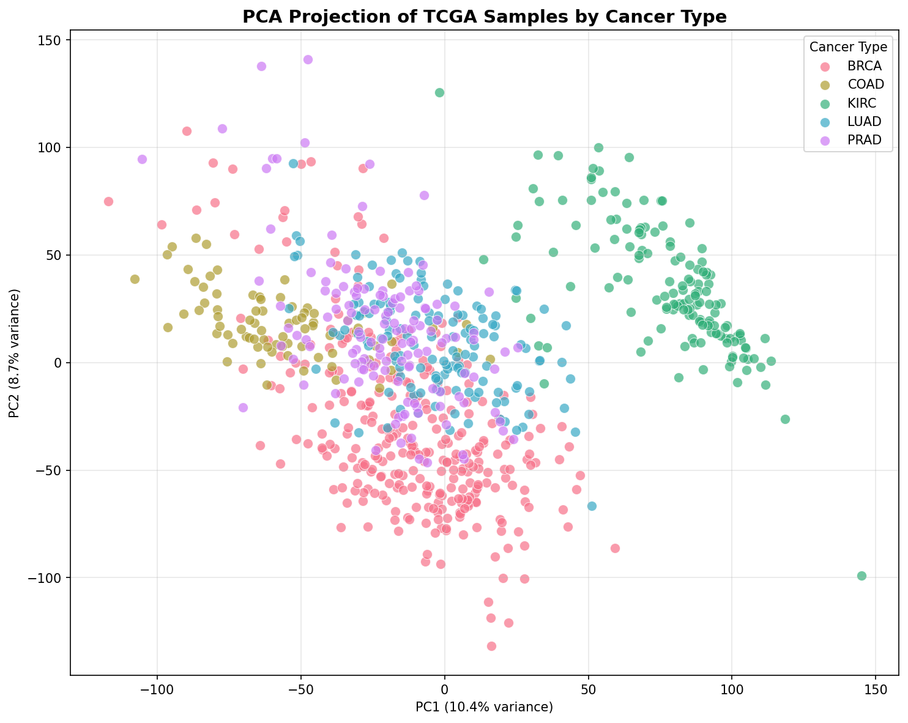
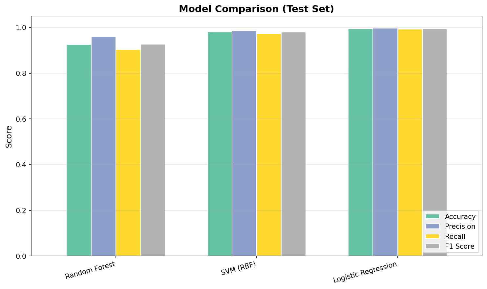
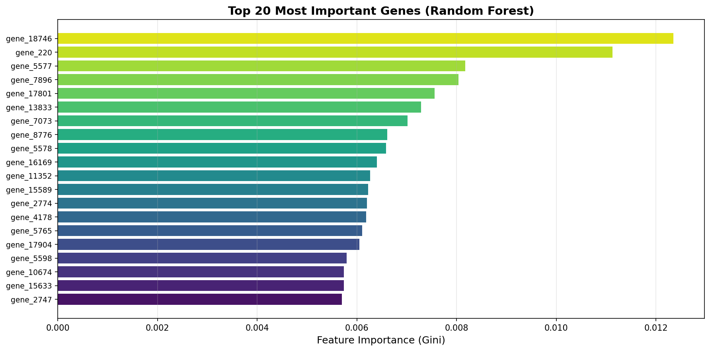
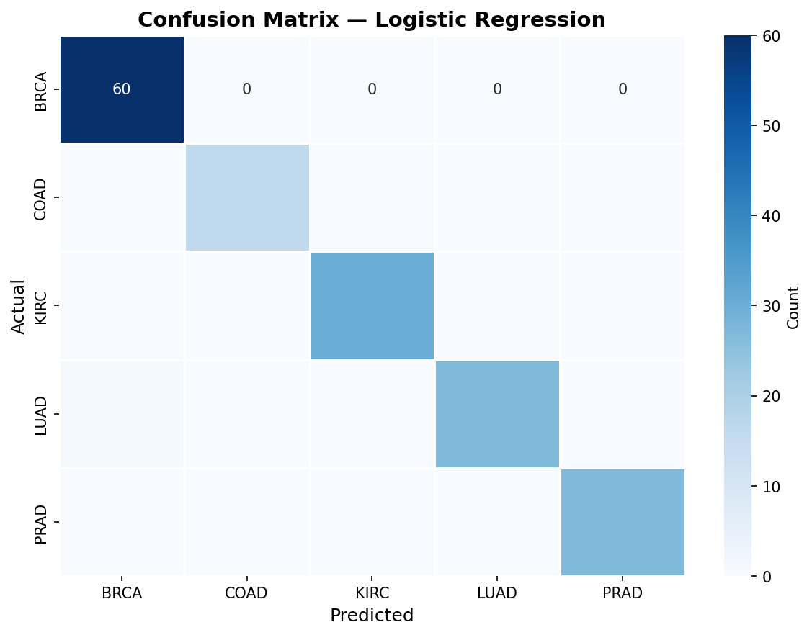
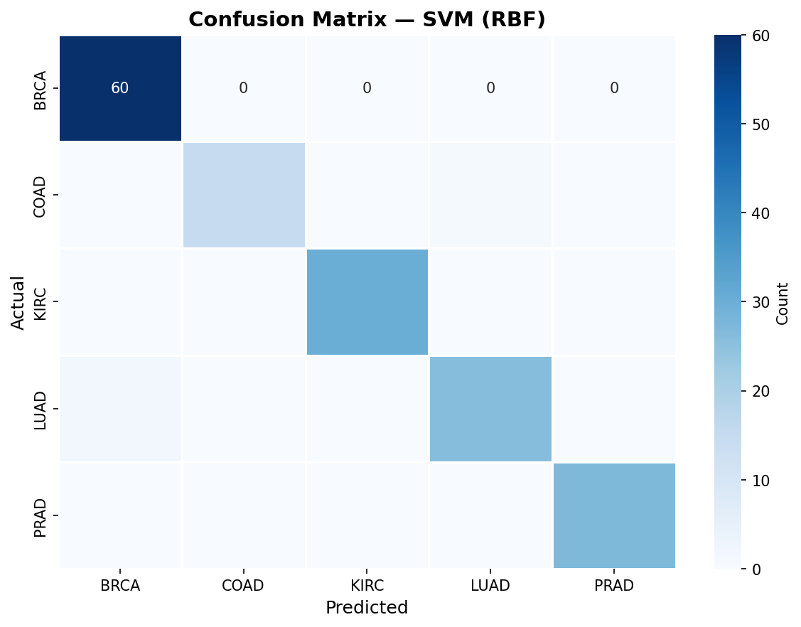

# TCGA Cancer Subtype Classification

A machine learning pipeline that classifies **cancer subtypes** from RNA-Seq gene expression data using The Cancer Genome Atlas (TCGA) Pan-Cancer dataset.

## Overview

This project demonstrates the application of classical ML algorithms to high-dimensional genomic data. Given the expression levels of ~20,000 genes, the model predicts which of 5 cancer types a tumor sample belongs to.

| Property | Value |
|---|---|
| Dataset | [TCGA Pan-Cancer RNA-Seq (UCI ML Repository)](https://archive.ics.uci.edu/dataset/401/gene+expression+cancer+rna+seq) |
| Samples | 801 |
| Features (genes) | 20,531 |
| Classes | BRCA, KIRC, COAD, LUAD, PRAD |

### Cancer Types

| Abbreviation | Full Name |
|---|---|
| **BRCA** | Breast Invasive Carcinoma |
| **KIRC** | Kidney Renal Clear Cell Carcinoma |
| **COAD** | Colon Adenocarcinoma |
| **LUAD** | Lung Adenocarcinoma |
| **PRAD** | Prostate Adenocarcinoma |

## Results

### Model Performance (Test Set, 161 samples)

| Model | Accuracy | Precision | Recall | F1 (macro) |
|---|---|---|---|---|
| Random Forest | 92.55% | 96.16% | 90.43% | 92.70% |
| SVM (RBF) | 98.14% | 98.61% | 97.32% | 97.94% |
| **Logistic Regression** | **99.38%** | **99.67%** | **99.29%** | **99.47%** |

🏆 **Best model: Logistic Regression** with 99.4% accuracy and 99.5% macro F1-score.

### Visualizations

#### PCA Projection

2D PCA visualization showing clear separation of cancer subtypes in gene expression space:

<p align="center">
  
</p>

#### Model Comparison

<p align="center">
  
</p>

#### Top 20 Most Important Genes (Random Forest)

<p align="center">
  
</p>

#### Confusion Matrices

<p align="center">
  
  
</p>

## Methods

### Preprocessing Pipeline
1. **Zero-variance filtering** — Remove 267 genes with no expression variation
2. **StandardScaler normalization** — Zero mean, unit variance (fit on training set only)
3. **Label encoding** — Map cancer types to integer labels
4. **Stratified train/test split** — 80/20 split preserving class proportions
5. **PCA dimensionality reduction** — Reduce to 434 components (95% variance retained)

### Models
All models tuned via **GridSearchCV** with **5-fold stratified cross-validation**:

- **Random Forest** — Tuned `n_estimators`, `max_depth`, `min_samples_split`
- **SVM (RBF kernel)** — Tuned `C`, `gamma`
- **Logistic Regression** — Tuned `C`, `penalty` (L2 regularization)

## Reproduce

### Requirements
- Python 3.10+
- Dependencies listed in `requirements.txt`

### Setup & Run

```bash
# Clone the repository
git clone https://github.com/yourusername/TCGA-Cancer-Subtype-Classification.git
cd TCGA-Cancer-Subtype-Classification

# Install dependencies
pip install -r requirements.txt

# Run the full pipeline
python main.py
```

The pipeline will:
1. Download the TCGA dataset (~70 MB, cached after first run)
2. Preprocess and split the data
3. Train and tune 3 classifiers
4. Print evaluation metrics
5. Save visualizations to `outputs/`

## Project Structure

```
TCGA-Cancer-Subtype-Classification/
├── main.py                # End-to-end pipeline entry point
├── requirements.txt       # Python dependencies
├── .gitignore
├── src/
│   ├── data_loader.py     # Download & cache TCGA dataset
│   ├── preprocessing.py   # Normalize, encode, split, PCA
│   ├── models.py          # Train RF, SVM, LR with GridSearchCV
│   ├── evaluate.py        # Metrics, reports, confusion matrices
│   └── visualize.py       # PCA plot, feature importance, CM heatmaps
├── data/                  # Cached dataset (gitignored)
├── outputs/               # Generated figures
└── notebooks/             # Optional EDA notebooks
```

## Tech Stack

- **Python** — Core language
- **Scikit-Learn** — ML models, preprocessing, evaluation
- **Pandas / NumPy** — Data manipulation
- **Matplotlib / Seaborn** — Visualization
- **UCI ML Repository** — Data source

## References

- [TCGA Pan-Cancer Analysis Project](https://www.cell.com/pb-assets/consortium/pancanceratlas/pancani3/index.html)
- [UCI ML Repository: Gene Expression Cancer RNA-Seq](https://archive.ics.uci.edu/dataset/401/gene+expression+cancer+rna+seq)
- Weinstein, J.N., et al. "The Cancer Genome Atlas Pan-Cancer analysis project." *Nature Genetics*, 2013.

## License

This project is for educational and research purposes. The TCGA dataset is publicly available under open access.
